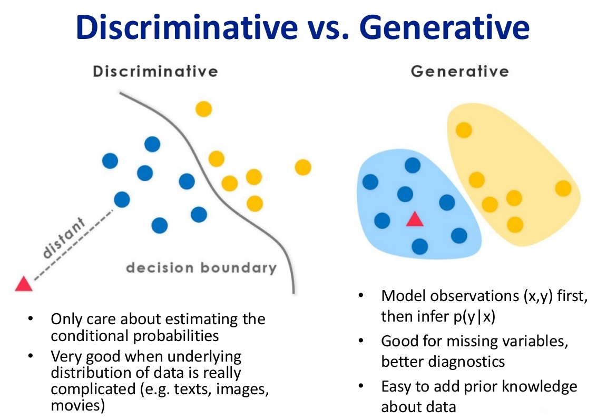
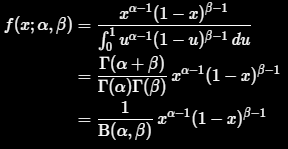
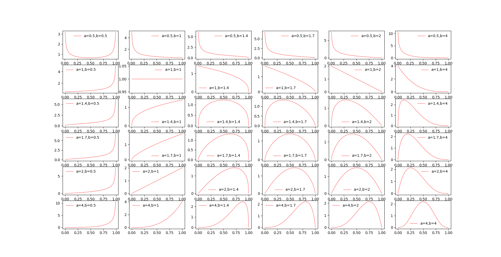
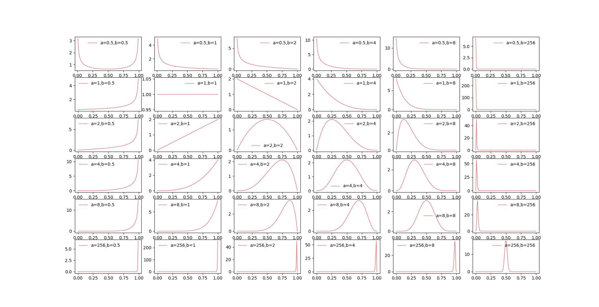

# hello-world
This is my first project for learning CS.

# Javascript 教程
https://wangdoc.com/javascript

# JavaScript深入之从原型到原型链
https://github.com/mqyqingfeng/Blog/issues/2

# AI算法工程师手册
http://www.huaxiaozhuan.com/

# Xiu-Shen WEI profile
http://lamda.nju.edu.cn/weixs/?AspxAutoDetectCookieSupport=1

# Blender游戏引擎(Python)
https://www.blender.org

# Google Sites
https://sites.google.com

# Sony Neural Network Console
https://dl.sony.com

# 线性代数的本质
https://charlesliuyx.github.io/2017/10/06/%E3%80%90%E7%9B%B4%E8%A7%82%E8%AF%A6%E8%A7%A3%E3%80%91%E7%BA%BF%E6%80%A7%E4%BB%A3%E6%95%B0%E7%9A%84%E6%9C%AC%E8%B4%A8/

# 秒懂词向量Word2vec的本质
https://zhuanlan.zhihu.com/p/26306795

# 有关3D模型与2D平面图像共同识别的灵感
https://www.mi.t.u-tokyo.ac.jp/kanezaki/pdf/3D_and_weaklearning.pdf

https://kanezaki.github.io

https://kanezaki.github.io/media/CRESTSeminar20181030_AsakoKanezaki.pdf

# 多维高斯分布是如何由一维发展而来的？
https://www.zhihu.com/question/36339816
https://www.datalearner.com/blog/1051485590815771

# 多元正态分布PPT
http://staff.ustc.edu.cn/~zwp/teach/MVA/Lec4_slides.pdf

# 判定模型 VS 生成模型

# 数学之美番外篇：平凡而又神奇的贝叶斯方法 
http://mindhacks.cn/2008/09/21/the-magical-bayesian-method/

# 如何通俗地理解“最大似然估计法”
https://www.matongxue.com/madocs/447.html

# 支持向量机通俗导论（理解SVM的三层境界）
https://blog.csdn.net/v_july_v/article/details/7624837

# 贝塔分布（Beta distribution）
<!--

-->

# 一些非常帅气的Javascript网站
https://ics.media/tutorial-createjs/basic.html

# Three.js教程
中文（青春热血）
http://www.hewebgl.com/article/articledir/1

日语（较详细）
https://ics.media/tutorial-three/index.html

官网
https://threejs.org/

# d3.js实现力导向图圈选框选
https://jsrun.net/5TqKp/edit?utm_source=website

# pytorch 官网
https://pytorch.org/

# DGL 
https://docs.dgl.ai/index.html

# ThingJS - 物联网3D可视化PaaS平台
http://www.thingjs.com/guide/?m=main

# 一个非常不错的CNN概要：Convolutional Neural Networks - Basics
https://mlnotebook.github.io/post/CNN1/

# 《机器学习的理论障碍》（Theoretical impediments to machine learning）贝叶斯网络之父
https://arxiv.org/pdf/1801.04016.pdf

https://mp.weixin.qq.com/s?__biz=MzI3MTA0MTk1MA==&mid=2652011751&idx=1&sn=689d2d8b76cca566636d11b18c4e56e4&chksm=f1210816c6568100f828d903263d1af7d4d11e181b3c395d2a2449557c5d62ed92f8ebdfc404&scene=21

# Google浏览器插件
沙拉查词 /Octotree /Github File Icons /Smallpdf /MathJax for Github /GitHub Repository Size

# CodePen
https://codepen.io/hello

# 解像度 (分辨率)
1. **dpi**　　　
dots per inchの略（入出力機器（プリンターなど）の解像度）　　　

2. **ppi**　　　
pixels per inchの略（画像解像度）　　　

※dpiとppiは、ほぼ同じ意味で使われる

# 裁减SVG文件大小的工具
https://jakearchibald.github.io/svgomg/

# 傅里叶变换

# WebGL教程
https://webglfundamentals.org/webgl/lessons/zh_cn/webgl-setup-and-installation.html

# Sphinx创建文档
http://www.sphinx-doc.org

# 点，边，面，多边形，表面

# 卡尔曼滤波
预测＋测量 N(x, u1, O1)N(x, u2, O2)=N(x, u3, O3) 

# 一个做网站的网站
https://www.squarespace.com/

# かっこいいメールアドレスの書き方
 □・──────────────────────────・□

# Javascript Svg动画控制插件
http://snapsvg.io/

# 2Dによる立体表現「Live2D」
https://www.live2d.com/ja/

# 日本研究統計データ
https://research-er.jp/stats

# 样条与约束
https://zhuanlan.zhihu.com/p/34825299

